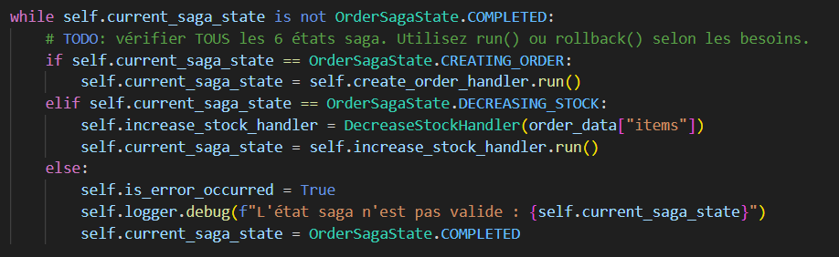
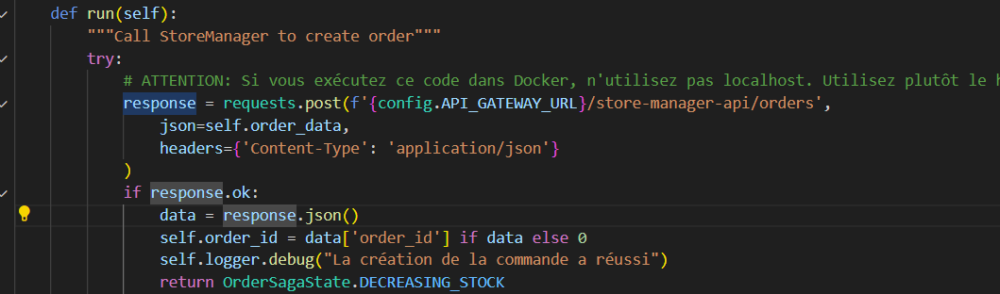
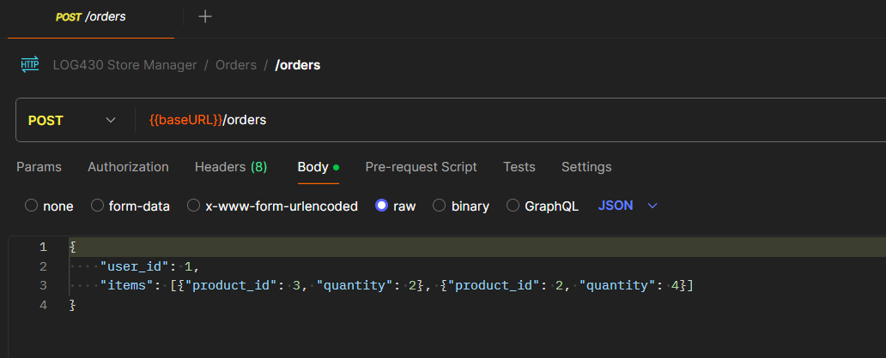
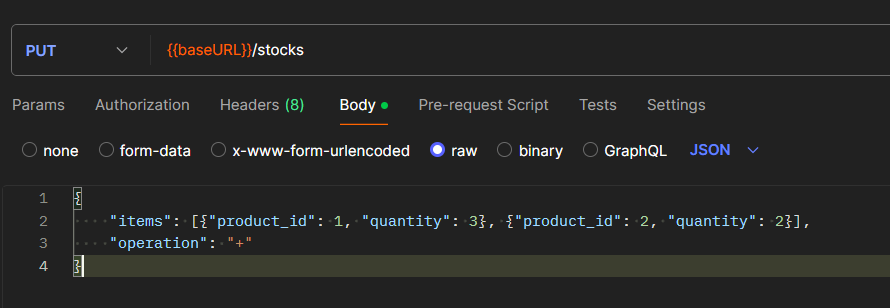
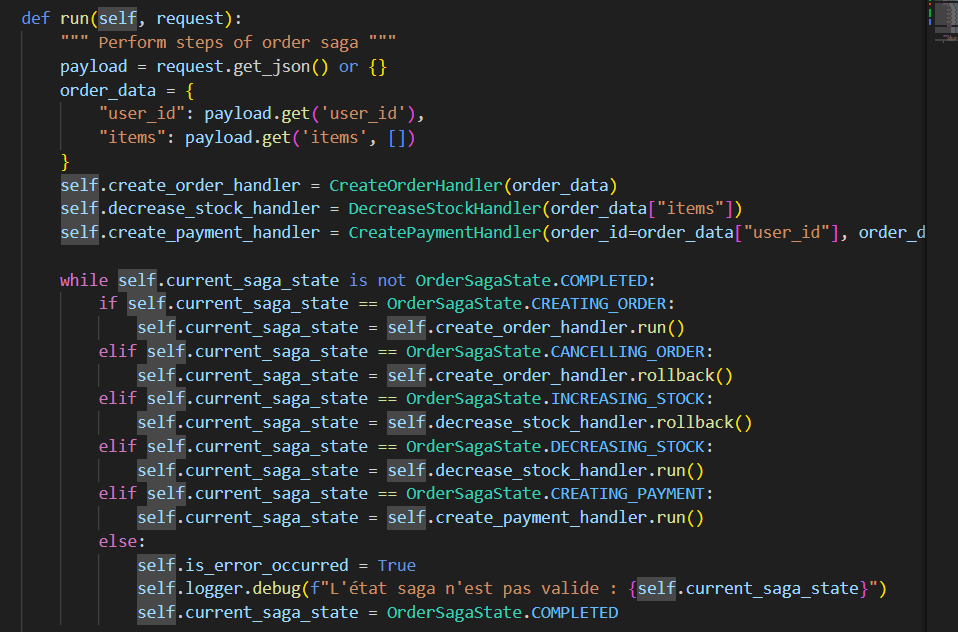
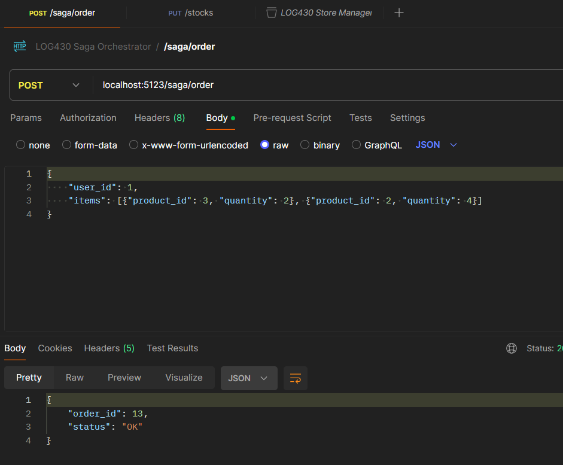
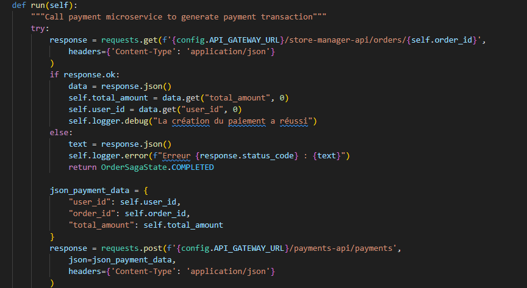
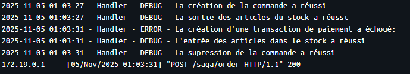
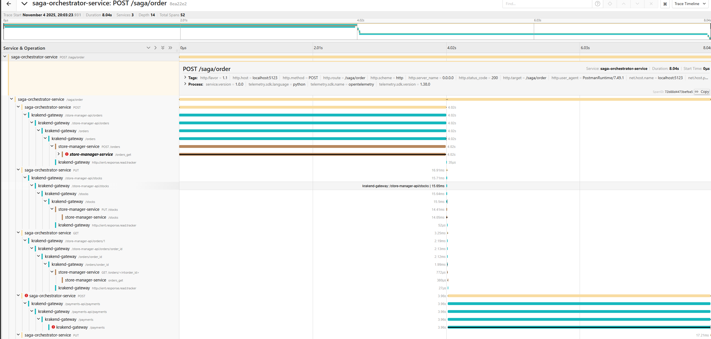

 \
William Lavoie \
Rapport de laboratoire \
LOG430 — Architecture logicielle \
4 Novembre 2025 \
École de technologie supérieure

## Questions
### Question 1
#### Lequel de ces fichiers Python représente la logique de la machine à états décrite dans les diagrammes du document arc42? Est-ce que son implémentation est complète ou y a-t-il des éléments qui manquent? Illustrez votre réponse avec des extraits de code.

C'est le fichier `src/controllers/order_saga_controller.py` qui est responsable d'implémenter la logique de la machine à états. Le contrôleur est responsable de choisir l'action à effectuer en fonction de l'état courant, et il appelle les fonctions nécessaires afin d'effectuer les différentes étapes de la saga. L'implémentation n'est toutefois pas complète tel que le suggère le `TODO`, car certains des états ne sont pas considérés, soit `CREATING_PAYMENT`, `INCREASING STOCK` et `CANCELLING ORDER`.

### Question 2
####  Lequel de ces fichiers Python déclenche la création ou suppression des commandes? Est-ce qu'il accède à une base de données directement pour le faire? Illustrez votre réponse avec des extraits de code.

C'est le fichier `src/handlers/create_order_handler.py` qui est response de la création ou supression des commandes. Celui-ci n'accède pas à une base de données, il envoie plutôt une requête HTTP vers `store_manager` qui est responsable de la persistence des données des commandes. Selon le patron saga, l'orchestreur ne fait que coordoner les différents services en leur envoyant des requêtes, c'est le concept d'une transaction distribuée.

### Question 3
#### Quelle requête dans la collection Postman du Labo 05 correspond à l'endpoint appelé dans create_order_handler.py? Illustrez votre réponse avec des captures d'écran ou extraits de code.

L'endpoint appelé par la requête dans `create_order_handler.py` est `/order` avec la méthode POST, qui dans la collection Postman correspond à `{{baseURL}}/orders` comme on peut le voir dans l'image ci-dessous.

### Question 4
#### Quel endpoint avez-vous appelé pour modifier le stock? Quelles informations de la commande avez-vous utilisées? Illustrez votre réponse avec des extraits de code.

J'ai appelé l'endpoint `/stocks` avec la méthode `PUT`. Pour la fonction `run` comme la fonction `rollback` je passe la liste des items, cependant dans le premier cas je passe "-" comme opération, et "+" dans le second cas. Ces paramètres ont été déterminés avec l'endpoint présent dans la collection Postman ci-dessous.

À noter que pour que la saga fonctionne, j'ai complété le code manquant dans `src/controllers/order_saga_controller.py`. La classe `CreatePaymentHandler` n'étant pas implémenté, elle retourne présentement toujours un succès.

Dans Postman on peut voir que la saga retourne un code 200 ce qui signifie qu'elle a bien été exécuté avec succès.

### Question 5
#### Quel endpoint avez-vous appelé pour générer une transaction de paiement? Quelles informations de la commande avez-vous utilisées? Illustrez votre réponse avec des extraits de code.

J'ai appelé l'endpoint `/orders/{order_id}` de `store_manager` avec la méthode `GET` afin d'aller chercher les informations par rapport à la commande, soit `user_id` et `total_amount` que j'ai ensuite utilisé, ainsi que `order_id` dans la requête de création de transaction de paiement vers l'endpoint `/payments` de `paiyments-api` avec la méthode `POST`. Le code du fichier `create_payment_handler.py` ci-dessous montre les appels mentionnées.

### Question 6
#### Quelle est la différence entre appeler l'orchestrateur Saga et appeler directement les endpoints des services individuels? Quels sont les avantages et inconvénients de chaque approche? Illustrez votre réponse avec des captures d'écran ou extraits de code.

La différence est qu'en utilisant l'orchestrateur Saga, les services ne sont pas directement couplés les uns aux autres, les transactions passant plusieurs par l'intermédiaire de l'orchestrateur. L'utilisation du patron Saga a comme avantage d'assurer l'intégrité transactionnelle en permettant de créer des transactions distribués (soit des sagas) atomiques, c'est-à-dire que si une étape échoue, les états de tous les services impactés sont remis à ce qu'ils étaient avant. Par contre, le patron Saga complexifie la communication entre microservices en ajoutant un module externe.

Si par exemple le service de paiement ne fonctionne pas, alors dans les logs de Docker on voit les lignes suivantes quand on exécute `localhost:5123/saga/order` dans Postman:

Cela démontre l'utilité de l'orchestrateur Saga, lorsque la requête vers le service de paiement échoue, des requêtes subséquentes sont envoyées aux endpoints de `store-manager` afin de remettre la quantité de stocks à ce qu'elle était et de supprimer la commande. Sans l'orchestrateur, les services devraient eux-même envoyer ces requêtes aux autres services, brisant ainsi le découplage des microservices. En résumé, un microservice ne doit pas être responsable de l'intégrité des données d'un autre service.

### Observations additionnelles

J'ai obtenu plusieurs erreurs au cours du laboratoire que j'ai résolu en utilisant le logging et Jaeger afin de trouver les causes. Jaeger est un outil permettant d'obtenir la trace, soit le flot d'exécution d'une saga afin de savoir exactement quelles requêtes ont été appelées. Cela m'a permis de trouver l'endroit exact ou une erreur se déclenchait. L'image ci-dessous présente la trace obtenue lorsque le service de paiement ne fonctionne pas (il a été fermé intentionellement pour la démonstration).

Les traces distribués sont une composante essentielle de l'observabilité dans le cadre d'une architecture microservices car elles permettent de comprendre et superviser le flot d'exécution du programme à travers les différents services.
